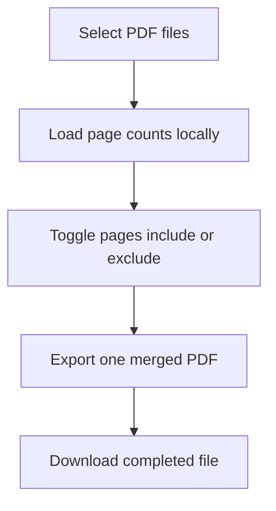

# One PDF

Privacy-first PDF page merger built for GitHub Pages.

## MVP features

- select multiple PDF files
- keep all pages included by default
- exclude or re-include individual pages
- export selected pages as one merged PDF
- process files locally in the browser

## User flow

## Local development

This app is static and can be opened directly in a browser, but a local server is recommended.

Examples:

- `python3 -m http.server 8080`
- `npx serve .`

Then open `http://localhost:8080`.

## Deploy to GitHub Pages

1. Push this folder to a GitHub repository.
2. Keep the included GitHub Actions workflow if you want automatic deploys from `main`.
3. In **Settings → Pages**, set the source to **GitHub Actions**.
4. Push to `main` and wait for the Pages deployment to finish.

## Release checklist

- verify the published GitHub Pages URL loads the landing page
- merge at least two real PDFs and confirm page order
- confirm excluded pages are absent from the downloaded file
- test in Chrome and Safari
- verify the app still works when served as static files with no backend

## Notes

- Files are not uploaded to a backend in this MVP.
- Very large PDFs may be slower because processing happens in the browser.
